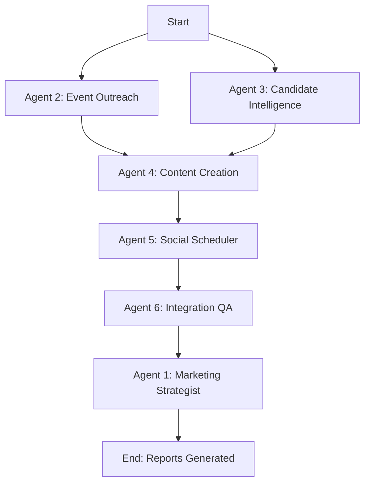

# Iraqi Election Platform - 6 AI Marketing Agents

## Overview

This directory contains the complete specification and architecture for 6 cooperative AI agents designed to populate, promote, and monitor the Iraqi Election and Event Management platform.

**Status**: Specification Complete  
**Mode**: Mock Data Generation (No Backend Dependency)  
**Technology**: Node.js/TypeScript (Conceptual)  
**Execution**: One-time run to generate initial marketing materials

---

## Directory Structure

```
marketing_cycle_2025-10-28/
├── README.md (this file)
├── daily_overview.md (consolidated dashboard)
│
├── agent_1_marketing_strategist/
│   ├── agent_spec.md (detailed specification)
│   └── config.json (configuration)
│
├── agent_2_event_outreach/
│   ├── agent_spec.md
│   └── config.json
│
├── agent_3_candidate_intelligence/
│   ├── agent_spec.md
│   └── config.json
│
├── agent_4_content_creation/
│   ├── agent_spec.md
│   ├── config.json
│   └── content_queue/ (output directory)
│
├── agent_5_social_scheduler/
│   ├── agent_spec.md
│   └── config.json
│
├── agent_6_integration_qa/
│   ├── agent_spec.md
│   └── config.json
│
└── shared/
    ├── schemas/
    │   ├── candidate_schema.json
    │   ├── event_schema.json
    │   ├── content_schema.json
    │   └── metrics_schema.json
    └── utils/
        └── timestamp_utils.ts
```

---

## Agent Roles

### 🎯 Agent 1: Strategic Marketing & Outreach Coordinator
**Role**: Master planner and consolidator  
**Execution Order**: 6 (Last)  
**Output**: `daily_strategy_report.md`

Analyzes outputs from all other agents and generates strategic insights, campaign recommendations, and performance analysis.

### 🏛️ Agent 2: Event Outreach Agent
**Role**: Event infrastructure builder  
**Execution Order**: 1 (Early)  
**Output**: `events_mock.json`

Generates a directory of 20 venues, service providers, and event infrastructure across 9 categories (Hospitality, Media, Logistics, Sponsors, NGOs, Security, Transport, Tech, Medical).

### 👥 Agent 3: Candidate Intelligence Agent
**Role**: Candidate data collector  
**Execution Order**: 1 (Parallel with Agent 2)  
**Output**: `candidates_mock.json`

Creates 50 candidate profiles distributed across all 18 Iraqi governorates with contact information, party affiliations, and biographical data.

### ✍️ Agent 4: Content Creation Agent
**Role**: Social media content generator  
**Execution Order**: 3 (After data collection)  
**Output**: `content_queue/*.json` (30 posts)

Produces bilingual (Arabic/Kurdish) social media content for Facebook, Twitter/X, and Instagram with culturally appropriate messaging and political neutrality.

### 📱 Agent 5: Social Media Scheduler
**Role**: Publishing simulator and metrics tracker  
**Execution Order**: 4 (After content creation)  
**Output**: `social_metrics.json`

Simulates posting and generates realistic engagement metrics (views, likes, shares, comments) for all content pieces.

### ✅ Agent 6: Integration & QA Agent
**Role**: Quality assurance and validation  
**Execution Order**: 5 (Before final consolidation)  
**Output**: `integration_summary.md`

Validates all data against JSON schemas, checks political neutrality, ensures data integrity, and generates comprehensive QA reports.

---

## Key Features

### ✅ Political Neutrality Enforcement
- No partisan language or endorsements
- Balanced representation across all parties
- Neutrality scoring (target: 1.0)
- Prohibited keyword detection

### 🌍 Comprehensive Geographic Coverage
- All 18 Iraqi governorates
- High-priority regions: Baghdad, Basra, Nineveh, Erbil
- Culturally appropriate regional targeting

### 🗣️ Bilingual Content
- 50% Arabic (Standard Arabic and Iraqi dialect)
- 50% Kurdish (Sorani script)
- Culturally sensitive messaging

### 📊 Data-Driven Approach
- JSON schemas for data validation
- ISO 8601 timestamps
- Agent signatures for provenance tracking
- Machine-readable audit trails

### 🔗 Future-Ready Architecture
- Designed to sync with backend APIs
- Can replace mock data with real sources
- Scalable to scheduled execution (node-cron)
- Compatible with existing Prisma schemas

---

## Data Schemas

All data conforms to JSON schemas defined in `shared/schemas/`:

1. **Candidate Schema** - Validates candidate profiles
2. **Event Schema** - Validates venue and event data
3. **Content Schema** - Validates social media posts
4. **Metrics Schema** - Validates engagement metrics

Schemas enforce:
- Required fields
- Data types
- Format validation (phone, email, URLs, timestamps)
- Governorate name consistency
- Agent signature presence

---

## Execution Flow



**Estimated Total Execution Time**: ~3-5 minutes

---

## Expected Outputs

### Data Files
1. `events_mock.json` - 20 venues/services
2. `candidates_mock.json` - 50 candidate profiles
3. `content_queue/post_*.json` - 30 social media posts
4. `social_metrics.json` - Engagement metrics

### Reports
1. `daily_strategy_report.md` - Strategic insights and recommendations
2. `integration_summary.md` - Quality assurance report
3. `daily_overview.md` - Consolidated dashboard
4. `*_log.json` files - Execution logs from each agent

---

## Success Metrics

| Metric | Target | Validation |
|--------|--------|------------|
| Candidate profiles | 50 | Agent 6 |
| Event venues | 20 | Agent 6 |
| Social posts | 30 | Agent 6 |
| Governorate coverage | 18/18 | Agent 6 |
| Political neutrality | 100% | Agent 6 |
| QA pass rate | ≥95% | Agent 6 |
| Estimated reach | 50,000+ views | Agent 5 |
| Engagement rate | 5-10% | Agent 5 |

---

## Implementation Notes

### Current Status
This directory contains **documentation and specifications only**. To implement:

1. Create Node.js/TypeScript scripts for each agent
2. Implement data generation logic per specifications
3. Add JSON schema validation using `ajv` or similar
4. Implement file I/O using `fs/promises`
5. Add logging using `winston` or similar

### Technology Stack (Conceptual)
- **Runtime**: Node.js 18+
- **Language**: TypeScript 5+
- **Schema Validation**: AJV (Another JSON Schema Validator)
- **File I/O**: Node.js `fs/promises`
- **Timestamps**: Native `Date` object
- **Randomization**: `crypto.randomBytes()` for IDs
- **Testing**: Jest for unit/integration tests

### Execution Command (Future)
```bash
# Install dependencies
npm install

# Run all agents in sequence
npm run agents:execute

# Or run individually
npm run agent:events
npm run agent:candidates
npm run agent:content
npm run agent:scheduler
npm run agent:qa
npm run agent:strategist
```

---

## Configuration

Each agent has a `config.json` file that defines:
- Target counts and thresholds
- Governorate lists and priorities
- Data generation rules
- Validation criteria
- Input/output paths
- Platform-specific settings

Configurations are designed to be easily adjusted for different:
- Geographic coverage
- Content volume
- Quality thresholds
- Platform priorities

---

## Quality Assurance

Agent 6 validates:
- ✅ Schema compliance
- ✅ Political neutrality
- ✅ Data completeness
- ✅ Format consistency
- ✅ Cross-reference integrity
- ✅ Performance metrics
- ✅ Governorate coverage

**Pass Criteria**: ≥95% of tests passing, zero critical failures

---

## Future Enhancements

### Phase 2: Real Data Integration
- Connect to real social media APIs (Facebook, Twitter, Instagram)
- Pull actual candidate data from official sources
- Integrate with live event management systems

### Phase 3: Scheduled Execution
- Add node-cron for 24-hour cycles
- Implement incremental updates
- Add change detection and delta processing

### Phase 4: AI-Enhanced Content
- Integrate OpenAI/Claude for richer content generation
- Add image generation (DALL-E, Midjourney)
- Implement sentiment analysis for better neutrality detection

### Phase 5: Backend Synchronization
- Sync JSON data to PostgreSQL database
- Implement real-time API endpoints
- Add webhook notifications for stakeholders

---

## Documentation

Each agent has detailed documentation:
- **agent_spec.md** - Complete functional specification
- **config.json** - Configuration settings and parameters

Shared resources:
- **JSON Schemas** - Data validation rules
- **Utility Functions** - Timestamp helpers

---

## Contributing

When extending this system:
1. Follow the established agent structure
2. Maintain political neutrality
3. Validate all outputs against schemas
4. Include timestamps and agent signatures
5. Document all configuration options
6. Write tests for new functionality

---

## Contact & Support

This system is part of the Iraqi Election and Event Management Platform.

**Project**: HamletUnified  
**Location**: `E:\HamletUnified\agents\marketing_cycle_2025-10-28\`  
**Documentation**: This README and individual agent specs

---

**Last Updated**: 2025-10-28T16:00:00Z  
**Version**: 1.0.0  
**Status**: Specification Complete, Ready for Implementation


